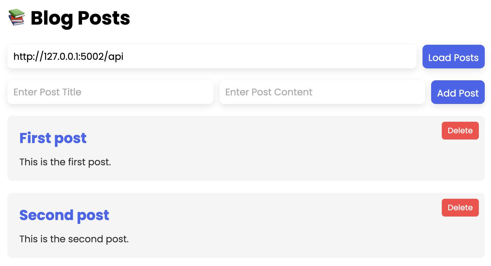

# Masterblog API Project

A simple blog API and frontend application built with Flask.



## Project Overview

This project consists of two main components:
1. A RESTful API backend that manages blog posts
2. A simple frontend web application to interact with the API

## Features

- RESTful API for blog post management
- Create, read, update, and delete operations for posts
- Frontend interface to view and manage posts
- API rate limiting
- CORS support
- Error handling

## Technical Stack

- **Backend**: Flask, Flask-CORS, Flask-Limiter
- **Frontend**: HTML, CSS, JavaScript
- **API Communication**: Fetch API

## Getting Started

### Prerequisites

- Python 3.6+
- pip (Python package manager)

### Installation

1. Clone this repository
   ```
   git clone https://github.com/yourusername/masterblog.git
   cd masterblog
   ```

2. Create a virtual environment
   ```
   python -m venv venv
   source venv/bin/activate  # On Windows: venv\Scripts\activate
   ```

3. Install the required packages
   ```
   pip install flask flask-cors flask-limiter
   ```

### Running the Application

1. Start the backend API server
   ```
   python api.py
   ```
   The API server will run on `http://127.0.0.1:5002`

2. In a separate terminal, start the frontend server
   ```
   python frontend.py
   ```
   The frontend will be available at `http://127.0.0.1:5001`

3. Open your browser and navigate to `http://127.0.0.1:5001`

## API Endpoints

| Endpoint | Method | Description |
|----------|--------|-------------|
| `/api/posts` | GET | Get all posts (with optional sorting and pagination) |
| `/api/posts` | POST | Create a new post |
| `/api/posts/<post_id>` | DELETE | Delete a post by ID |
| `/api/posts/<post_id>` | PUT | Update a post by ID |
| `/api/posts/search` | GET | Search posts by title or content |

### Query Parameters for GET `/api/posts`

- `sort`: Field to sort by (`title` or `content`)
- `direction`: Sort direction (`asc` or `desc`)
- `page`: Page number for pagination
- `limit`: Number of posts per page

### Query Parameters for GET `/api/posts/search`

- `title`: Text to search for in post titles
- `content`: Text to search for in post contents

## Project Structure

```
masterblog/
├── api.py             # Backend API server
├── frontend.py        # Frontend server
├── templates/
│   └── index.html     # Main HTML template
└── static/
    ├── styles.css     # CSS styles
    └── main.js        # Frontend JavaScript
```

## Troubleshooting

If you encounter any issues:

1. Ensure both servers are running in separate terminals
2. Check that you're using the correct API URL (http://127.0.0.1:5002/api) in the frontend
3. Look for error messages in the browser console and server terminals
4. Verify that the CORS configuration allows requests from your frontend origin

## Future Improvements

- Add user authentication
- Implement categories for posts
- Add comments functionality
- Improve pagination UI
- Add search functionality to the frontend

## License

This project is licensed under the MIT License - see the LICENSE file for details.
